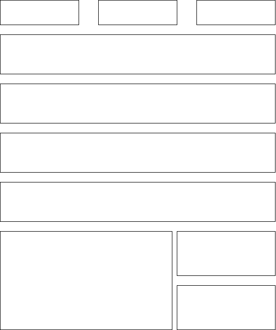
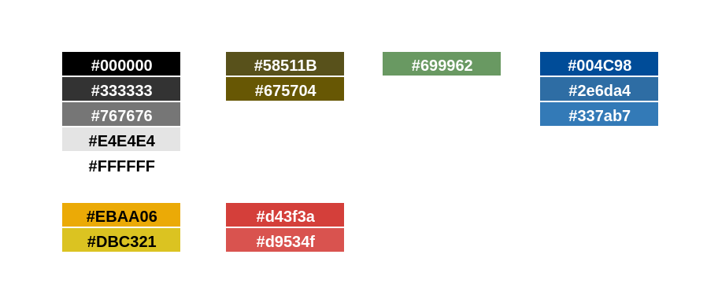

# Guia de estilo

## 1 Introdução

•Objetivo do guia de estilo
•Organização e conteúdo do guia de estilo
•Público-alvo do guia de estilos (programadores, gerentes, equipe de suporte)
•Como utilizar o guia (em produção e manutenção)
•Como manter o guia
### 1.1 Objetivo do guia de estilo
O guia de estilo e um registro das principais decisões de design tomadas, de forma que elas não se percam, isto é, sejam efetivamente incorporadas no produto final. O guia de estilo tem como objetivo se tornar um meio de comunicação entre os membros de design, assim como os desenvolvedores, para servir como base para tomadas de decisão e criação de padrões que podem ser reutilizados durante versões futuras.

### 1.2 Organização e conteúdo do guia de estilo

A organização do guia de estilo terá como base o ciclo de vida de Mayhew.

### 1.3 Público-alvo do guia de estilos

O público alvo deste guia de estilo são os desenvolvedores.

### 1.4 Como utilizar o guia

Deve ser utilizado como um guia para adição de novas funcionalidades, alterações no layout, alteração e desenvolvimento de novos protótipos.

### 1.5 Como manter o guia

O guia deve ser atualizado a cada novo ciclo do processo do ciclo de vida de Mayhew

## 2 Descrição do ambiente de trabalho

O usuário, ao acessar o site, encontra vários banners com notícias diversas, com um menu no topo com letras miúdas, e um footer com acessos rápidos. 

## 3 Elementos de interface

### 3.1 Disposição espacial e grid
A página utiliza um grid pouco intuitivo e de difícil localização do que se procura dentro do site. É dividido em três partes: a primeira possui três divisões para acessar requerimentos, tributos e licitações; a segunda parte possui quatro banners para outros serviços; a terceira parte apresenta as três últimas notícias da prefeitura postadas no site.

## 3.2 Janelas
A navegação do site é feita em sua maioria por hyperlinks que levam à outras páginas com funções específicas para cada um dos serviços disponíveis. Estas páginas, entretanto, não seguem todas o mesmo padrão, com diferenças de botões, cores e layouts.

### 3.3 Tipografia

A fonte utilizada em todo o site foi a [Open sans](https://fonts.google.com/specimen/Open+Sans#standard-styles)

### 3.4 Símbolos não tipográficos
Na barra de atalhos, há para cada opção um ícone atrelado. Estes ícones têm o mesmo padrão visual, porém o texto que os acompanha é pequeno e de baixa resolução, levando a uma dificuldade de visualização.

### 3.5 Cores

Cores usadas no site

### 3.6 Animações
O site não possui nenhuma animação durante a navegação.

## 4 Elementos de interação
### 4.1 Estilos de interação
O site utiliza de uma série de hyperlinks para outras páginas como modo principal de interação. Estes hyperlinks existem tanto na barra de atalhos como nos banners. Alguns dos acessos à diferentes sites aparecem em mais de um lugar na página e nem todos os banners informam claramente a qual função que eles levam. 

### 4.2 Seleção de um estilo
Para a montagem dos protótipos, teremos um foco em eliminar todas as redundâncias de links para outras páginas, simplificar e melhorar a visualização da barra de atalhos e aumentar a clareza das funções dos banners assim como separar devidamente os grids de notícia para que o público consiga discernir mais facilmente qual rota tomar para realizar sua tarefa.

### 4.3 Aceleradores

Não foram encontrados nenhum nesse site
## 5 Elementos de ação

### 5.1 Preenchimento de campos

### 5.2 Seleção

### 5.3 Ativação
## 6 Vocabulário e padrões

### 6.1 Terminologia

### 6.2 Tipos de tela

### 6.3 Sequências de diálogos

Versão |  O que foi inserido? | Data | Autor(es)| Revisor
---- |----- | ---- | ---- | ----
0.1 | Criação do documento, introdução, Descrição do ambiente de trabalho, Inicio dos elementos de interface e Elementos de interação |12/03/2022| [Ciro](https://github.com/ciro-c) | 
0.2 | Adição dos tópicos dos Elementos de Interface e Elementos de Interação |12/03/2022| [Vinicius Lima](https://github.com/vinelime) | 