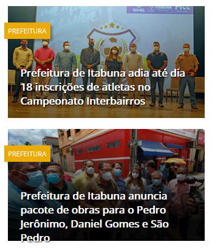
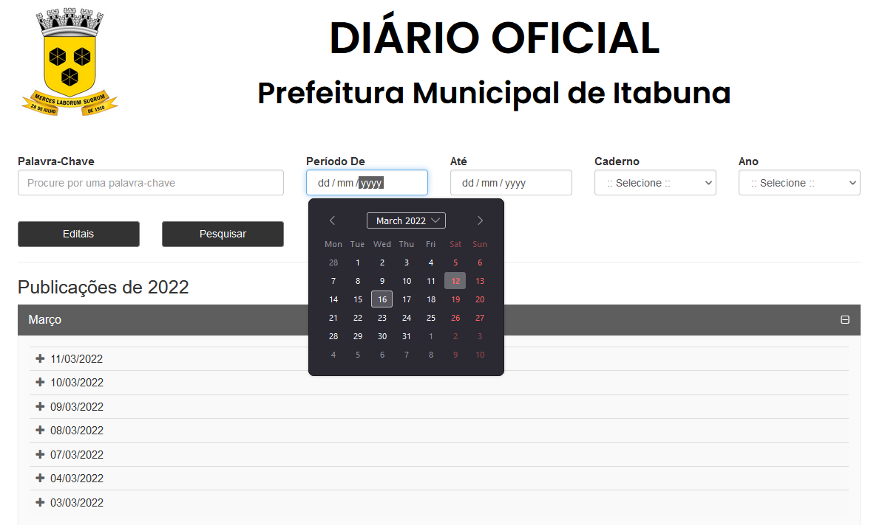

# Guia de estilo

## 1 Introdução

- Objetivo do guia de estilo
- Organização e conteúdo do guia de estilo
- Público-alvo do guia de estilos (programadores, gerentes, equipe de suporte)
- Como utilizar o guia (em produção e manutenção)
- Como manter o guia

### 1.1 Objetivo do guia de estilo
O guia de estilo e um registro das principais decisões de design tomadas, de forma que elas não se percam, isto é, sejam efetivamente incorporadas no produto final. O guia de estilo tem como objetivo se tornar um meio de comunicação entre os membros de design, assim como os desenvolvedores, para servir como base para tomadas de decisão e criação de padrões que podem ser reutilizados durante versões futuras.

### 1.2 Organização e conteúdo do guia de estilo

A organização do guia de estilo terá como base o ciclo de vida de Mayhew.

### 1.3 Público-alvo do guia de estilos

O público alvo deste guia de estilo são os desenvolvedores.

### 1.4 Como utilizar o guia

Deve ser utilizado como um guia para adição de novas funcionalidades, alterações no layout, alteração e desenvolvimento de novos protótipos.

### 1.5 Como manter o guia

O guia deve ser atualizado a cada novo ciclo do processo do ciclo de vida de Mayhew

## 2 Descrição do ambiente de trabalho

O usuário, ao acessar o site, encontra vários banners com notícias diversas, com um menu no topo com letras miúdas, e um footer com acessos rápidos. 

## 3 Elementos de interface

### 3.1 Disposição espacial e grid
A página utiliza um grid pouco intuitivo e de difícil localização do que se procura dentro do site. É dividido em três partes: a primeira possui três divisões para acessar requerimentos, tributos e licitações; a segunda parte possui quatro banners para outros serviços; a terceira parte apresenta as três últimas notícias da prefeitura postadas no site.

## 3.2 Janelas

### 3.3 Tipografia

A fonte utilizada em todo o site foi a [Open sans](https://fonts.google.com/specimen/Open+Sans#standard-styles)

<figure align="center">
    
    <figcaption>Figura 2 - fonte Open Sans</figcaption>
</figure>

### 3.4 Símbolos não tipográficos
Na barra de atalhos, há para cada opção um ícone atrelado. Estes ícones têm o mesmo padrão visual, porém o texto que os acompanha é pequeno e de baixa resolução, levando a uma dificuldade de visualização.

<figure align="center">
    
    <figcaption>Figura 3 - Ícones da barra de atalhos</figcaption>
</figure>

### 3.5 Cores

Cores usadas no site:

<figure align="center">
    
    <figcaption>Figura 4 - Cores</figcaption>
</figure>

### 3.6 Animações

Ao se passar o mouse por cima de um artigo, é removido o obscurecimento da imagem, tornando-a clara
<figure align="center">
    
    <figcaption>Figura 5 - Artigo com foco (acima) vs Artigo sem foco (abaixo)</figcaption>
</figure>

## 4 Elementos de interação

### 4.1 Estilos de interação

### 4.2 Seleção de um estilo

### 4.3 Aceleradores (Teclas de atalho)

Não foram encontrados nenhum nesse site

## 5 Elementos de ação

### 5.1 Preenchimento de campos

O campo de preenchimento presente na barra de navegação possui um menu suspenso com sugestões baseadas em pesquisas anteriores para preenchimento automático.

<figure align="center">
    
    <figcaption>Figura 6 - Campo de pesquisa da barra de navegação</figcaption>
</figure>

Outros campos presentes no site não possuem tal funcionalidade.

### 5.2 Seleção

Na página Diário Oficial, encontram-se vários elementos de seleção, sendo esses:
- Seleção de datas para gerar um intervalo de tempo que será utilizado como filtro da pesquisa
- Seleção de um caderno a ser pesquisado, como Concurso Público, Edital, etc.
- Seleção de um ano específico para filtrar a pesquisa
- Cards representando cada mês, contendo submenus com os dias que houveram publicações, e ditas publicações

<figure align="center">
    
    <figcaption>Figura 7 - Página Diário Oficial e seus campos de seleção</figcaption>
</figure>

### 5.3 Ativação

A ativação dos formulários ocorre ao clicar no botão de enviar localizado na parte inferior de cada formulário do site, já nos elementos de seleção, a ativação ocorre ao se clicar no botão Pesquisar.

## 6 Vocabulário e padrões

### 6.1 Terminologia

Por ser destinado ao público geral, a terminologia utilizada no site é simples, com excessão de alguns termos como Licitações, que podem requerer um conhecimento superficial de processos políticos.

### 6.2 Tipos de tela

Os tipos de tela encontrados no site foram os seguintes:

- Tela de artigo - Possui título, um artigo escrito, e uma ou mais imagens
- Tela de formulário - Possui um formulário para ser preenchido
- Tela informativa - Possui textos informativos e links
- Tela de seleção - Possui botões que redirecionam para uma tela de outro tipo

A tela do Diário Oficial conta com varios campos de seleção e não se encaixa em nenhum padrão encontrado em outras telas.

## 7. Bibliografia
    1. Barbosa, S. D. J.; Silva, B. S. da; Silveira, M. S.; Gasparini, I.; Darin, T.; Barbosa, G. D. J. (2021) Interação Humano-Computador e Experiência do usuário. Autopublicação

## 8. Versionamento

Versão |  O que foi inserido? | Data | Autor(es)| Revisor
---- |----- | ---- | ---- | ----
0.1 | Criação do documento, introdução, Descrição do ambiente de trabalho, Inicio dos elementos de interface e Elementos de interação |12/03/2022| [Ciro](https://github.com/ciro-c) | 
0.2 | Adição dos tópicos 3.1 e 3.4 dos Elementos de Interface |12/03/2022| [Vinicius Lima](https://github.com/vinelime) | [Vinicius Roriz](https://github.com/viniciusroriz)
0.3 | Adição da seção 5, 6, e 7, e do tópico 3.6 | 12/03/2022 | [Vinicius Roriz](https://github.com/viniciusroriz)| 